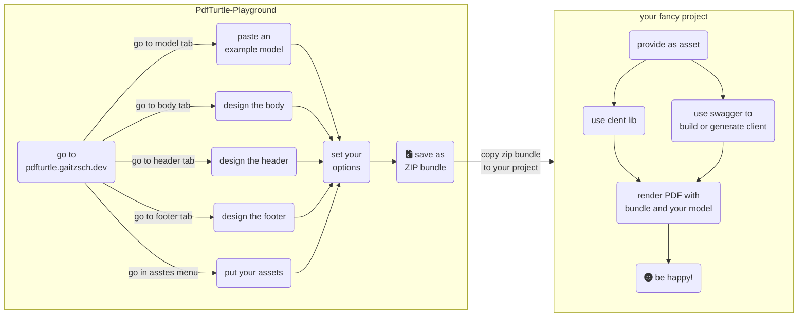

# PdfTurtle 🐢 HTML to PDF generation service

[](https://github.com/lucas-gaitzsch/pdf-turtle/actions/workflows/pipeline.yml)
[](https://goreportcard.com/report/github.com/lucas-gaitzsch/pdf-turtle)
[](https://codecov.io/gh/lucas-gaitzsch/pdf-turtle)
[](https://sonarcloud.io/summary/new_code?id=lucas-gaitzsch_pdf-turtle)
[](https://sonarcloud.io/summary/new_code?id=lucas-gaitzsch_pdf-turtle)
[](https://sonarcloud.io/summary/new_code?id=lucas-gaitzsch_pdf-turtle)
[](https://sonarcloud.io/summary/new_code?id=lucas-gaitzsch_pdf-turtle)
[](https://hub.docker.com/r/lucasgaitzsch/pdf-turtle)

### A painless html to pdf rendering service

[PdfTurtle](https://github.com/lucas-gaitzsch/pdf-turtle) generates PDF reports and documents from HTML templates or raw HTML.

Try it! Here's a [**DEMO**\_\_🐢\_\_](https://pdfturtle.gaitzsch.dev/).


## 🎢 Features

- ✅ Free, OpenSource and Self-Hosted
- 💬 Generate PDFs in a descriptive way from HTML and CSS (with JavaScript support)
- ✨ Supports modern HTML and CSS standards (uses latest Chromium engine)
- 👻 Builtin template engines (go-template, raymond and django)
- 💼 Bundle template and assets in ZIP file (see [Bundle workflow](#bundle-workflow-recommended))
- 🚀 Fast generation with limited resources (limited multithreading)
- 🔥 Multiple replicas supported (stateless service design)
- 🖥 Frontend ([Playground](https://pdfturtle.gaitzsch.dev/)) for rapid development
- 💫 Beautiful fonts included and preoptimized style (CSS) for PDF or print
- 📦 [Container image](https://hub.docker.com/r/lucasgaitzsch/pdf-turtle) available (see [Run with docker](#with-docker-container-recommended))

## 💥 How to run the service

### With docker container (recommended)

The container image is available on [Docker Hub](https://hub.docker.com/r/lucasgaitzsch/pdf-turtle).

With the tag _\*-playground_ you get a bundled image with the web playground.

```bash
docker pull lucasgaitzsch/pdf-turtle

docker run -d \
    -p 8000:8000 \
    --name pdf-turtle \
    --restart unless-stopped \
    lucasgaitzsch/pdf-turtle
```

Included fonts:

- Open Sans
- Roboto
- Noto Emoji

### Config

| command line argument | environment variable | type    | default | description                                             |
| --------------------- | -------------------- | ------- | ------- | ------------------------------------------------------- |
| --help                | -                    | -       | -       | Show help                                               |
| --logDebug            | LOG_LEVEL_DEBUG      | boolean | false   | Debug log level active                                  |
| --logJsonOutput       | LOG_JSON_OUTPUT      | boolean | false   | Json log output                                         |
| --renderTimeout       | RENDER_TIMEOUT       | integer | 30      | Render timeout in seconds                               |
| --workerInstances     | WORKER_INSTANCES     | integer | 30      | Count of worker instances                               |
| --port                | PORT                 | integer | 8000    | Server port                                             |
| --maxBodySize         | MAX_BODY_SIZE        | integer | 32      | Max body size in megabyte                               |
| --servePlayground     | SERVE_PLAYGROUND     | boolean | false   | Serve playground from path "./static-files/playground/" |
| --secret              | SECRET               | string  | ""      | Secret used as bearer token                             |

## 🚀 How to use

### Bundle Workflow (recommended)



#### 1. Prepare project

Choose the fitting client lib for your language or generate / build your own by the OpenApi (Swagger) description.

#### 2. Design your PDF in the playground

Go to [🐢PdfTurtle-Playground](https://pdfturtle.gaitzsch.dev/), put an example model as JSON and design your PDF.
Download the bundle as ZIP file and put it in your resources/assets.


#### 3. Call the service with the client and your data

Send a request to a PdfTurtle instance with your bundle and your model.
You will get a rendered PDF.

**And thats it.**

#### Hint: You can split your bundle

If you want to have the same header for all documents, you can create a ZIP file with with only the header.html and the required assets. Now you can call the Service with multiple bundle files. The service will assemble the files together.
Single files can be send as bundle-component without compressing to a ZIP file. All files with other names than "index.html", "header.html", "footer.html" and "options.json" will be put to the folder "/assets/".

### PdfTurtle Playground

You can write and test templates with the [builtin playground](https://pdfturtle.gaitzsch.dev/).

### Client libs

- [📦 .NET Standard 2.0 (.NET Core 2.0+ & .NET Framework 4.6.1+) Client](https://github.com/lucas-gaitzsch/pdf-turtle-client-dotnet)
- [📦 Golang (Go) Client](https://github.com/lucas-gaitzsch/pdf-turtle-client-golang)

### Swagger

Use Swagger-UI under [/swagger/index.html](https://pdfturtle.gaitzsch.dev/swagger/index.html) as API documentation.

You can use the swagger description (_/swagger/doc.json_ or [./server/docs/swagger.json](./server/docs/swagger.json)) to generate a API client for the language of your choice.

### Postman

You can import the swagger file to test the service with Postman or an alternative.

## Included template engines

| Template style                               | Package       | PdfTurtle key  | URL                                 |
| -------------------------------------------- | ------------- | -------------- | ----------------------------------- |
| Golang                                       | html/template | **golang**     | https://pkg.go.dev/html/template    |
| Django-syntax like (require _model._ prefix) | pongo2        | **django**     | https://github.com/flosch/pongo2    |
| Handlebars-syntax like                       | raymond       | **handlebars** | https://github.com/aymerick/raymond |

### Included template functions

| Function name    | Parameters       | Description                                  |
| ---------------- | ---------------- | -------------------------------------------- |
| **marshal**      | object           | Encodes provided object as JSON string       |
| **barcodeQr**    | content          | Renders a SVG QR code from content           |
| **barcodeEan**   | content          | Renders a SVG EAN code from content          |
| **strContains**  | haystack, needle | Does the haystack contains the needle        |
| **strHasPrefix** | haystack, needle | Does the first string starts with the second |
| **strHasSuffix** | haystack, needle | Does the first string end with the second    |
| **add**          | float64, float64 | Adds two float64 numbers                     |
| **subtract**     | float64, float64 | Subtracts two float64 numbers                |
| **multiply**     | float64, float64 | Multiplies two float64 numbers               |
| **divide**       | float64, float64 | Divides two float64 numbers                  |
| **float64ToInt** | float64          | Convert a int to float64                     |
| **intToFloat64** | int              | Convert a float64 to int                     |
| **bitwiseAnd**   | int, int         | a \& b                                       |

## Development / Build from source

See [README_DEV.md](./README_DEV.md).

## 🚧 Roadmap

- [x] Bundle/Package support for exchangeable templates
- [x] Client libs
  - [x] [.NET Standard 2.0 (.NET Core 2.0+ & .NET Framework 4.6.1+)](https://github.com/lucas-gaitzsch/pdf-turtle-client-dotnet)
  - [x] [Golang](https://github.com/lucas-gaitzsch/pdf-turtle-client-golang)
  - [ ] Kotlin, Java (JVM languages)
  - [ ] ..?
- [ ] Markdown to PDF
- [ ] Preload and cache JavaScript libs

## 🔨 Contribution

Contributors are welcome! Feel you free to fork the project and open a pull request.

If you wrote a client lib for a uncovered language please contact me. I will create a repo for you or link your client lib in this readme file.

## ☢ Build with

- [go](https://github.com/golang/go)
- [chromedp (golang chromium driver)](https://github.com/chromedp/chromedp)
- [goquery](https://github.com/PuerkitoBio/goquery)
- [chromium (render engine)](https://github.com/chromium/chromium)
- [raymond (handlebars template engine)](https://github.com/aymerick/raymond)
- [pongo2 (django template engine)](https://github.com/flosch/pongo2)
- [zerolog](https://github.com/rs/zerolog)
- [go-arg](https://github.com/alexflint/go-arg)
- [barcode](https://github.com/boombuler/barcode) and [svgo](https://github.com/ajstarks/svgo)
